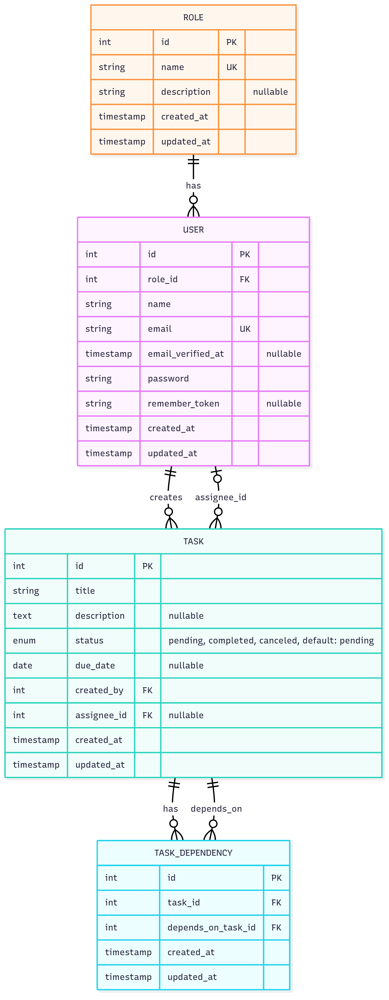

# Task Management System API

A production-ready Laravel 12 REST API for task management with role-based access control, JWT authentication, and dependency management.

## Features

- **JWT Authentication** with token blacklisting
- **Role-based Access Control** (Managers and Users)
- **Task Management** with CRUD operations
- **Task Dependencies** with cycle detection
- **Dependency Validation** (tasks cannot be completed until dependencies are complete)
- **Advanced Filtering** by status, due date range, and assignee
- **Pagination** for task listings
- **Docker Support** with Laravel Sail
- **Comprehensive API Documentation** with Postman collection

## Technology Stack

- **Laravel 12** - PHP Framework
- **JWT Auth** - Stateless authentication
- **MySQL** - Database
- **Docker** - Containerization
- **Pest** - Testing framework

## Quick Start

### Prerequisites

- PHP 8.2+
- Composer
- MySQL 8.0+
- Docker (optional)

### Local Setup

1. **Clone the repository**
   ```bash
   git clone https://github.com/Abdullah-Hamdy-1998/task-manager.git
   cd task-manager
   ```

2. **Install dependencies**
   ```bash
   composer install
   npm install
   ```

3. **Environment setup**
   ```bash
   cp .env.example .env
   php artisan key:generate
   php artisan jwt:secret
   ```

4. **Configure database**
   Update `.env` file with your database credentials:
   ```env
   DB_CONNECTION=mysql
   DB_HOST=127.0.0.1
   DB_PORT=3306
   DB_DATABASE=task_manager
   DB_USERNAME=your_username
   DB_PASSWORD=your_password
   ```

5. **Run migrations and seeders**
   ```bash
   php artisan migrate --seed
   ```

6. **Start the development server**
   ```bash
   php artisan serve
   ```

   The API will be available at `http://localhost:8000`

### Docker Setup (Recommended)

For a complete Docker-based installation, follow these detailed steps:

#### Prerequisites
- Docker Desktop installed and running
- Git

#### Step-by-Step Installation

1. **Clone the repository**
   ```bash
   git clone https://github.com/Abdullah-Hamdy-1998/task-manager.git
   cd task-manager
   ```

2. **Install Composer dependencies**
   ```bash
   # If you have PHP/Composer locally
   composer install
   
   # OR using Docker (if you don't have PHP locally)
   docker run --rm -v $(pwd):/app composer install
   ```

3. **Environment Configuration**
   ```bash
   # Copy the environment file
   cp .env.example .env
   ```

   **Update the `.env` file with Docker-specific settings:**
   ```env
   APP_NAME="Task Management System"
   APP_ENV=local
   APP_KEY=
   APP_DEBUG=true
   APP_URL=http://localhost
   
   # Database Configuration for Docker
   DB_CONNECTION=mysql
   DB_HOST=mysql
   DB_PORT=3306
   DB_DATABASE=task_manager
   DB_USERNAME=sail
   DB_PASSWORD=password
   
   # Optional: Set custom ports if needed
   APP_PORT=80
   FORWARD_DB_PORT=3306
   VITE_PORT=5173
   ```

4. **Install Laravel Sail (if not already installed)**
   ```bash
   composer require laravel/sail --dev
   ```

5. **Start Docker containers**
   ```bash
   # Start all services in detached mode
   ./vendor/bin/sail up -d
   ```

6. **Generate Application Key**
   ```bash
   ./vendor/bin/sail artisan key:generate
   ```

7. **Generate JWT Secret Key**
   ```bash
   ./vendor/bin/sail artisan jwt:secret
   ```

8. **Run Database Migrations and Seeders**
   ```bash
   ./vendor/bin/sail artisan migrate --seed
   ```

## Seeded Test Accounts

The system comes with pre-seeded accounts for testing:

### Manager Account
- **Email:** `manager@example.com`
- **Password:** `password`
- **Role:** Manager
- **Permissions:** Create/update tasks, assign tasks to users

### User Account
- **Email:** `user@example.com`
- **Password:** `password`
- **Role:** User
- **Permissions:** View assigned tasks, update own task status

## API Endpoints

### Authentication

| Method | Endpoint | Description |
|--------|----------|-------------|
| POST | `/api/register` | Register a new user |
| POST | `/api/login` | Login and get JWT token |
| POST | `/api/logout` | Logout and blacklist token |

### Tasks

| Method | Endpoint | Description | Authorization |
|--------|----------|-------------|---------------|
| GET | `/api/tasks` | List all tasks (managers) or my tasks (users) | Authenticated |
| POST | `/api/tasks` | Create a new task | Manager only |
| GET | `/api/tasks/{id}` | Get task details | Task owner/assignee |
| PUT | `/api/tasks/{id}` | Update task | Manager only |
| PATCH | `/api/tasks/{id}/status` | Update task status | Manager or assignee |
| POST | `/api/tasks/{id}/dependencies` | Add task dependency | Manager only |


### Query Parameters

**Task Filtering:**
- `status` - Filter by task status (pending, completed, canceled)
- `due_from` - Filter tasks due from date (Y-m-d format)
- `due_to` - Filter tasks due to date (Y-m-d format)
- `assignee` - Filter by assignee ID
- `per_page` - Number of items per page (default: 15)

**Example:**
```
GET /api/tasks?status=pending&due_from=2025-01-01&due_to=2025-12-31&per_page=10
```

## Authentication

The API uses JWT (JSON Web Tokens) for stateless authentication.

### Getting a Token

```bash
curl -X POST http://localhost/api/login \
  -H "Content-Type: application/json" \
  -d '{
    "email": "manager@example.com",
    "password": "password"
  }'
```

### Using the Token

Include the token in the Authorization header:

```bash
curl -X GET http://localhost/api/tasks \
  -H "Authorization: Bearer YOUR_JWT_TOKEN"
```

## Role-Based Access Control

### Manager Permissions
- Create and update tasks
- Assign tasks to users
- View all tasks
- Add dependencies to tasks


### User Permissions
- View only assigned tasks
- Update status of own tasks
- Cannot create tasks

## Task Dependencies

- Tasks can have dependencies on other tasks
- A task cannot be marked as completed until all its dependencies are completed
- Circular dependencies are automatically detected and prevented
- Dependencies are managed through the `/api/tasks/{id}/dependencies` endpoint

## Database Schema



## Testing

Run the test suite using Pest:

```bash
# Local
php artisan test

# Docker
./vendor/bin/sail artisan test
```

## API Documentation

You can import the Postman collection for testing the API:

- [Download Collection](postman/TaskManagementSystem.postman_collection.json)